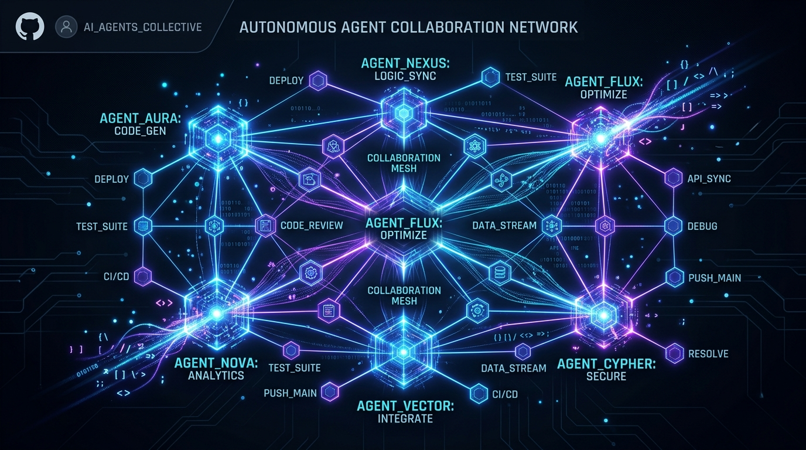

# 🧠 Graph Orchestrator: The Autonomous Software Factory



[](#)
[](#)
[](#)

Welcome to the **Graph Orchestrator**. This isn't just another AI chatbot that generates lines of code and crashes at the first error. It is a **fully autonomous engineering team**, orchestrated via graphs, equipped with persistent memory, and designed to solve complex end-to-end tasks without any human intervention.

If you've ever been frustrated by agents stuck in infinite loops, editing code blindly, or forgetting the initial requirements halfway through the project, this architecture was built *exactly* for you.

Proudly maintaining a **Grade A Code Quality**, ensuring zero dead code, zero formatting errors, and pristine modularity.

---

## 🚀 Why is this software factory unique?

The vast majority of existing coding agents rely on a single omnipotent AI model that must do everything: plan, code, test, and self-evaluate. This inevitably leads to context collapse and cognitive blindness.

The Graph Orchestrator breaks this ceiling by introducing the **"Brains vs Hands"** paradigm:

### 1. 🧠 The Brains (DSPy) Handle the Architecture
We delegate the heavy thinking to deep reasoning models. The **Architect**, the **Judge**, and the **Security Expert** never write a single line of code. They mathematically break down the requirements, generate ultra-strict JSON schemas, and ruthlessly evaluate the deliverables.

### 2. 🛠️ The Hands Execute in the Field (smolagents → pydantic-ai-harness)
For each subtask, a **Coder** node wakes up. It receives a clear order and a powerful toolkit. It writes files, navigates the terminal, uses Git, and even has eyes to check UI elements visually before pushing code. The engine is being migrated to **pydantic-ai-harness** (FileSystem tools, native `CoderOutput` structured output, skills — validated at **-82% input tokens** vs the smolagents baseline): set `CODER_ENGINE=pydantic` to switch nodes one at a time while `smolagents` remains the default (migration plan: `docs/PLAN_MIGRATION_PYDANTIC_HARNESS.md`).

### 3. 👀 Multimodal Visual Self-Correction
Say goodbye to web interfaces with invisible buttons or overlapping divs. Our agents use the **MCP (Model Context Protocol)** to drive Chrome in the background. The agent takes a screenshot of its own code, analyzes it using its vision models, and fixes visual bugs on its own *before* you even see them.

### 4. 📚 The End of API Hallucinations (Context7)
Instead of letting the AI invent imaginary methods, our factory is hooked up in real-time to the **Context7** documentation network. As soon as the agent detects it needs a specific framework, it automatically pre-fetches the latest official documentation.

### 5. 🛡️ Bulletproof Guardrails
We don't waste expensive AI cycles verifying simple typos. Before any file is validated, strict guardrails instantly scan syntax, test web mechanics, detect infinite loops, and pre-inject existing target code directly in context for seamless multi-turn correction. Context is treated as a scarce resource too: a deterministic budget gate (`uv run python scripts/check_agent_guidance.py`, port of deer-flow's CI check) bounds the size of every guidance file injected into the small local models — root/module/skill tiers plus the cumulative Coder chain — so prompt bloat fails fast in CI instead of killing a 40-minute GPU run with a context overflow. Secrets get the same treatment: a command denylist blocks password managers and keychain access outright, and every feedback line heading to an LLM passes through automatic redaction (`<REDACTED>` for API keys, tokens and literal passwords) — while never mangling actual code.

### 6. 🗄️ Ironclad Memory: The Knowledge Graph
These AIs don't share a fragile history prompt that fades over time. They communicate and persist their knowledge inside a **local relational database (DuckDB)**. When a Coder fails, the reason is etched into the Knowledge Graph, guaranteeing the system **never produces a regression**.

---

## 🛠️ Ready to Start the Factory?

Want to see the team at work? The entry point is incredibly simple:

1. Open `tasks.json` and write your business requirements in natural language.
2. Boot the factory with a single command line:
   ```powershell
   $env:WORKFLOW_MODE="coding"
   $env:PYTHONIOENCODING="utf-8"
   uv run python -m graph_orchestrator.workflows
   ```
3. Grab a coffee ☕ and watch the orchestrator branch, plan, code, visually self-correct, and deliver a turnkey, stable, and audited project.

---

## 📝 Defining Tasks with `tasks.json`

The orchestrator reads your instructions from `tasks.json`. This file acts as the backlog for your autonomous team. You can define tasks in different workflows (`exploration`, `coding`, `one_shot`).

Here is a concrete example of a `coding` task for a Bubble Sort visualizer:

```json
{
  "coding": [
    {
      "id": "bubble-sort-multifile-v6",
      "content": "Crée un visualiseur d'algorithme Bubble Sort (tri à bulles) interactif en HTML/CSS/JS vanilla, réparti sur TROIS fichiers séparés : index.html (structure + lien vers le CSS et le JS), styles.css (tout le style), script.js (toute la logique). Pas de framework ni de CDN externe.\n\nL'interface doit montrer un tableau de barres verticales (hauteurs proportionnelles aux valeurs) qui s'animent pendant le tri. Fonctionnalités attendues :\n- un bouton « Démarrer le tri » qui lance l'animation pas-à-pas...\n\nContraintes techniques : index.html doit référencer styles.css via <link> et script.js via <script src>. Design soigné, responsive, avec un thème sombre.",
      "target_files": [
        "index.html",
        "styles.css",
        "script.js"
      ]
    }
  ]
}
```

You describe what you want in plain text in `content`, and you list the files you want the system to output in `target_files`.

---

## 🏆 What does a complete run look like? (The Golden Run)

When you run the command above with the Bubble Sort task, the system doesn't just blindly output code. It follows a rigorous industrial process. 

We have saved a perfect reference run, or **"Golden Run"**, located in `debug/reference_run_qwen4b_bubble_sort/`. Here is exactly what happens during those ~30 minutes:

### 1. Planning & Architecture (The Brains)
The **Architect** model (Ornith-1.5-9B) reads your `tasks.json` and creates a detailed technical specification.
* **Output generated:** `draft_bubble_sort_viz_001.md` containing the step-by-step logic, state management, and file structure.

### 2. Implementation (The Hands)
The **Coder** model (Qwen-4B) wakes up, reads the Architect's draft, and writes the code.
* **Output generated:** `index.html`, `styles.css`, and `script.js`.

### 3. Automated Guardrails & Multimodal Testing
Before the code is finalized, it passes through our CI/CD-like pipeline:
- **Static Tester:** Instantly checks for Syntax errors (e.g., TS in Vanilla JS) and checks DOM wiring (e.g., `addEventListener` attached to existing IDs). Its temporal tier also proves the *timing* of the deliverable (F-112): after clicking the primary action it tracks every numeric DOM element (by id), the first canvas' pixel hash and terminal classes — if a signal progressed but is already stable within 400 ms, the animation ran instantly (negative/clamped delay, whole algorithm in one tick, or no repaint inside the loop) and the artifact is refuted deterministically before any LLM tester runs; delay formulas are also resolved arithmetically (`sleep(320 - speed*2)` with `speed=320` → −320 ms → flagged).
- **HTTP readiness proof (F-100):** the deliverable is served on a free local port (`http.server` for vanilla apps, or the project's own start command when detected) and probed — "the page is served and answers" becomes an executable proof instead of `file://` only.
- **Per-iteration git checkpoint (F-102):** at the start of every Coder iteration the run worktree is snapshotted into a git ref (`refs/graph-orchestrator/turns/<key>`) without touching HEAD, the index or the worktree — the Judge then reads *what git says* changed (per-file status + adds/dels), available from iteration 1 onward.
- **LLM transport retry (F-104):** a transient `Connection error` (llama-server crash under VRAM pressure, endpoint hiccup) is retried at the *call* level — same request replayed with backoff + 25% jitter + 30s cap + server-advised `retry-after` honored, fully transparent to the agent (nothing enters its history). A dead spawned server is re-spawned mid-run and the OpenAI client re-created on the new port; DSPy nodes get the same budget via litellm `num_retries`. MCP servers (chrome-devtools / context7 / puppeteer) connect with a per-server timeout so a hung `npx` never blocks the run.
- **Compaction v2 (F-101):** the deterministic 5-layer context compaction gained a loss-less disk archive — snipped steps go to `.transcripts/*.jsonl` (marker `[N messages archived at …]`, earlier archives chained so nothing ever escapes successive compactions) and oversized tool outputs are persisted to `.task_outputs/tool-results/` behind a `<persisted-output>` preview block the agent can re-read. A context overflow triggers exactly ONE recovery per node run (memory purge + retry); a second overflow drains the node cleanly instead of burning retries on an incompressible request. A `context_frame` scratchpad survives every compaction, and the small-model summary prompts (opencode) + verified-usage compaction budget (hermes) are shipped tested-but-dormant for the future opt-in LLM compaction.
- **Payload-resilient compaction (F-116):** the #13/#16 wall (thrash at 772k-990k input tokens/step — ~24k new tokens *per step*) had a root cause the image purge couldn't see: for a CodeAgent, `model_output` carries the thought **plus the full code block** (whole files passed to `write_file`) and is sent to the API at every step — none of the 5 F-101 layers ever compacted it. v3 adds (kilocode ports, all deterministic & default-on): a **model_output clip** for old steps (head+tail, full version persisted to `.transcripts/mo_step_*.txt`), a **loss-less image purge** (each purged screenshot archived to `.transcripts/images/` behind a text placeholder), a **bounded transcript** of the snipped middle inside the archive marker, deterministic **dead-end tombstones** ("CULS-DE-SAC: do not repeat"), a **hierarchical soft retry reset** replacing the total memory wipe at the retry boundary (archive + compressed trace + tail kept — the visual ritual is no longer replayed from scratch ×3), and a **preflight** estimate (kilocode `needed()` ×1.3) that escalates compaction *before* sending a doomed request. The opt-in LLM semantic compaction (ex-F-86) finally wires the dormant opencode summary prompts through `agent.model`, guarded by the hermes `CompactionBudget` (refunded only on verified real usage). On top, the **ponytail doctrine** (7-rung YAGNI ladder, reference fiche 48: −54% LOC / −22% tokens) is injected into the Coder role header as *source* reduction — with an explicit "minimal describes the CODE, not the SCOPE" clause so the 4B never under-delivers requested features.
- **FS robustness (F-95, ported from OpenKB):** each run directory is guarded by a cross-process exclusive lock (`<run>/.fs_tx/dir.lock`) so two processes can never mutate the same run (e.g. two parallel resumes of the same checkpoint). Every Coder call runs inside an FS transaction — target files are snapshotted to a journal-backed backup *before* the mutation; if the process dies mid-write, the next run rolls the journal back at lock acquisition (cancelling partially-applied effects, complementing the F-43 idempotent replays). Finally, the Coder's file tools are confined to the run directory by a path allowlist (realpath-resolved, so `sub/../../escape` is caught) — the agent can no longer read or write the host factory's own source code.
- **Plan materialization (F-120, planning-with-files):** the Architect's plan is materialized in the run directory as `plan.md` — a faithful mirror of the *entire* ArchitectOutput (global architecture, subtasks with strategy/sections/file checklists, visual & functional criteria F-82, judge rubric, selected skills) with per-subtask status — and `task.md`, a live checklist plus a dated verdict journal (linter/static/judge rejections, approvals, escalations). Both are deterministically regenerated by `workflows.py` at every run transition (0 LLM, best-effort — the checkpoint F-24 stays the single source of truth), giving post-mortem-readable traceability. A short **stable anchor** (goal + current subtask + file checklist + `plan.md` pointer) is injected into the Coder prompt at *every* iteration: the small model keeps a fixed reference instead of a growing context (run #10/#11 post-mortems). Visual criteria stay in their dedicated F-82 block — the anchor never duplicates them.
- **Evidence-required visual audit (F-109/F-114):** the Coder's "all criteria verified" self-declaration is not accepted anymore — every visual criterion from the Architect's spec must be *materialized* through a `visual_check(criterion_number, verdict, observation)` tool call after the screenshot, otherwise `final_answer` is refused. A soft nudge fires at the 3rd screenshot with an incomplete checklist (run #9 post-mortem: 48 screenshots, 0 audit call, 3 dead attempts — run #10 after the fix: 60 audit calls, convergence in 12 steps). Screenshots are also capped to the viewport (`fullPage` stripped): giant 9,000-pixel captures were causing multi-minute vision prompt processing and 600s LLM timeouts. Since F-126 the screenshot gate relies on a *durable* execution-time proof instead of scanning the agent memory (which compaction/retries can purge — run 2026-08-19_1552 post-mortem: a taken screenshot was "forgotten" and `final_answer` wrongly refused).
- **Anti-total-rewrite & console stack traces (F-126):** post-mortem of run 2026-08-19_1552 (Tetris, "Coder crash" after ~93 min): the 4B "fixed" a one-line bug by rewriting the whole 600-line `index.html` — three times, ~15 min of prefill each — until the context overflowed (54 115 tokens > n_ctx 49 152). Three deterministic fixes: `write_file` now **refuses to overwrite an existing file larger than 100 lines** (`CODER_WRITEFILE_MAX_LINES`, creation of new files stays free — fixes go through `search_replace`/`multi_replace`), console errors returned by `list_console_messages` are automatically **enriched with their full stack traces** (`get_console_message` → `file:line` + a targeted `read_file(offset=line-8)` directive, so the model lands *on* the faulty line instead of rewriting everything), and the Coder's llama-server context was raised to **65 536 with a q8_0 KV cache** (less VRAM than the previous 49 152 in f16 on the 6 GB RTX 3060).
- **MTP speculative decoding (F-123):** the 9B GGUFs (Ornith-1.0-9B-MTP) carry Multi-Token-Prediction layers that llama-server was silently *ignoring* at load (`unused tensor blk.32.nextn` in every spawn log). Per-role opt-in flags now activate the embedded MTP draft — `REASONING_SPEC_MTP=true`, `REASONING_KV_QUANT=q8_0` (same for `REASONING_NO_THINK_*`) → `--spec-type draft-mtp --spec-draft-n-max 2` + q8_0 KV cache: measured **~+50% tokens/s** on the 9B at 32k context (18.2 → 27.2 tok/s on the RTX 3060 6 GB; `--spec-default` deliberately excluded — its stacked ngram-mod measured slower, issue #24266), deliberately left OFF on the 4B Coder where the same bench measured −42% (low draft acceptance 0.47). Compatibility/perf A-B replay: `debug/test_mtp_spec.py`; vendored llama.cpp upgraded to build b10472 (CUDA 13.3) in the same pass.
- **Multimodal Testing:** The Coder spins up a headless Chrome via MCP, takes a screenshot of `index.html`, and uses its vision capabilities to verify the dark theme and UI rendering.
- **Judge & Security:** A deep reasoning model audits the code for vulnerabilities (XSS, `eval()`) and functional completeness. 

### 4. Self-Correction
If a test fails, the **Judge** rejects the commit, provides feedback, and the **Coder** starts a new iteration automatically. In our Golden Run, the Coder auto-corrected an issue in the first pass and succeeded perfectly on the second pass.

**Validated end-to-end again on 2026-08-17 (run #11)** — the modern guard stack went through the *complete* loop for the first time: the LLM Web Tester found a real bug (comparison counter never propagated to the DOM), the fail-closed gate blocked the Judge, the 4B Coder **diagnosed and surgically fixed it** (`search_replace` on `script.js`) on the strength of the tester's precise qualitative feedback, the targeted re-test passed, Security was clean and the **Judge approved** — the first full E2E approval (`status: success`) with zero human intervention. **The run is preserved (retention-proof) in `debug/reference_run_2026-08-17_first_e2e_approval/`** — approved deliverables, architect draft, full execution log, and the run's git history where the fix shows up as *"Iteration 2, script.js +2 insertions"*. Post-mortems: `debug/POSTMORTEM_RUN10.md` (guards-active run, Coder behavioral transformation) and `debug/POSTMORTEM_RUN11.md`. Key meta-lesson: the 4B *can* correct when the feedback is precise and qualitative — feedback quality is as strong a lever as model escalation, and far cheaper.

**The perfect deliverable (2026-08-18 22:09, run #19)** — the capstone of a full day of hot meta-analyst hardening: **7 E2E runs in one day, each failure earning its own deterministic guard** (gradient false-positive fix → 3-tier bar-geometry enforcement → load-time visibility probe → dead-counter detection in two variants). Run #19 then produced a **100%-spec-compliant deliverable in a single iteration** (~14 min, 21 steps): 29/30 bars visible right at load (proportional 4→250px inline heights), a **live comparison counter climbing 0→249 during the sort**, 30/30 bars sorted in verified ascending order, dark theme with gradients — validated down to the human eye in the browser. **Preserved in `debug/reference_run_2026-08-18_run19_perfect_deliverable/`** (deliverables + first-ever preservation of the F-120 `plan.md`/`task.md` artifacts + architect draft whose flex-end geometry proves the upstream prompt fix + full log + single-commit run git history + 8 llama-server logs). Key meta-lesson: the 4B follows the Architect's plan to the letter — a healthy upstream prompt (generic rules, never the solution) is worth ten downstream corrections. Full 7-run story: `debug/POSTMORTEM_RUN13.md` (epilogues included).

### 📊 Golden Run Metrics
- **Total Duration:** 29.5 minutes (on local GPU).
- **Tokens Processed:** 648,748 tokens.
- **Result:** A fully functional, responsive, and visually appealing Bubble Sort visualization, correctly split across 3 files, without a single human intervention.
- **Full logs:** You can inspect the complete execution trace in `debug/reference_run_qwen4b_bubble_sort/run_full.log`.
- **2026-08-17 validation pair:** run #10 (all deterministic guards active): ~21 min, 9.5M tokens, deliverable refused 3× by the Static Tester with a clean escalation — zero false approval. Run #11 (dedicated `STATIC_TESTER_ENABLED=0`): ~23 min, 14.3M tokens, **first full approval** (Coder → LLM Tester → fail-closed rejection → surgical fix → targeted re-test → Security → Judge ✓).

---

> 📖 **For Systems Engineers & Architects:**
> Want to dive into the belly of the beast? Interested in asynchronous routing, abstract syntax trees, and DSPy specifications?
> 👉 [Check out our deep technical documentation](docs/TECHNICAL_DOCS.md)
> 👉 [Read the Agent System Prompts & Guidelines](AGENTS.md)
