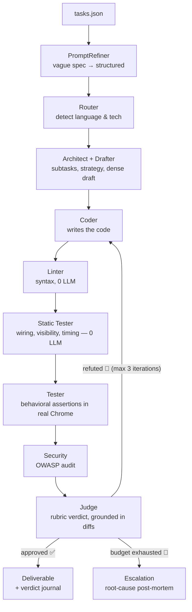

# 🧠 Graph Orchestrator — The Autonomous Software Factory


This is not another chatbot that dumps code and crashes on the first error. **Graph Orchestrator** is a fully autonomous engineering team — orchestrated as a graph, equipped with persistent memory, and running **100% on local models**. Give it a plain-language spec; it plans, codes, visually verifies, tests, audits, and delivers — correcting its own mistakes along the way.

The core idea: **Brains vs Hands**. Reasoning nodes (DSPy) architect, referee and audit; an execution agent (pydantic-ai-harness) writes files, drives Chrome, uses Git — and never ships anything the deterministic gates haven't approved first.

---

## ✨ Highlights

| | |
|---|---|
| 🧠 **Brains vs Hands** | Architect, Judge & Security (Ornith-9B, DSPy) plan and referee; the Coder (Qwen-4B, pydantic-ai) executes with a full toolkit — files, search/replace, git, browser, live docs. |
| 🔒 **100% local & private** | Two multimodal GGUFs served by `llama-server` on a single 6 GB GPU (RTX 3060). No API keys, nothing leaves the machine — with MTP speculative decoding for ~+50% tokens/s. |
| 👀 **Eyes before shipping** | The Coder opens its own deliverable in a real Chrome, screenshots it, and must back every visual criterion with an *evidence-required* audit call — a self-declaration is refused. |
| 🛡️ **Deterministic guardrails first** | Linter, static web tester (syntax / wiring / visibility / timing), loop & stall guards, prompt-size budget gate, secret redaction… trivial bugs never burn an LLM cycle. |
| 🗄️ **Iron memory** | A DuckDB knowledge graph + event stream persists every claim, refutation and verdict — and durable lessons are recalled into future runs. |
| 🏭 **Industrial resilience** | Crash recovery via checkpoints, filesystem transactions, LLM transport retries, and **graph continuity even when the Coder dies mid-run** (its verdict gets salvaged, the gates referee the disk). |

---

## 🚀 Quick Start

```powershell
git clone <this-repo> && cd graph-orchestrator-smolagents
uv sync                                    # install dependencies
powershell .\scripts\download_models.ps1   # fetch the GGUF models → models/
Copy-Item .env.example .env                # then set WORKFLOW_MODE=coding
uv run agent_graph.py
```

Describe what you want in `tasks.json` — plain text, plus the expected output files:

```json
{
  "coding": [
    {
      "id": "bubble-sort-multifile-v6",
      "content": "Crée un visualiseur d'algorithme Bubble Sort interactif en HTML/CSS/JS vanilla, réparti sur TROIS fichiers séparés : index.html, styles.css, script.js. … Design soigné, responsive, thème sombre.",
      "target_files": ["index.html", "styles.css", "script.js"]
    }
  ]
}
```

Grab a coffee ☕ — a full run takes 15–45 min on local GPU and lands in `runs/<date>_<slug>/` with the deliverables, the plan, a per-iteration verdict journal, and a git history of every Coder change.

---

## 🔁 The Pipeline



Every loop is bounded: 3 correction iterations per subtask, then an Escalation node writes a structured root-cause diagnosis instead of looping forever. Fail-closed everywhere — an unverified check can never produce an approval.

---

## 🏆 Proven End-to-End

Reference runs are preserved (deliverables, drafts, full logs, run git history) under `debug/reference_run_*`:

| Run | Date | What it proved |
|---|---|---|
| **Golden Run** | 2026-08 | Full 3-file deliverable, self-corrected in 2 iterations, ~30 min / 649k tokens — zero human intervention. |
| **Run #11** — first E2E approval | 2026-08-17 | LLM Tester caught a *real* bug (counter never reaching the DOM), the 4B Coder fixed it surgically via `search_replace`, targeted re-test passed, Judge approved. |
| **Run #19** — perfect deliverable | 2026-08-18 | 100% spec-compliant in a **single iteration** (~14 min, 21 steps) after a day of hot meta-analyst hardening (7 runs, each failure → its own deterministic guard). |

> **Honesty note** — the run #19 deliverable was later found to count *swaps* instead of *comparisons*: a historical false approval, root-caused to a hollow upstream draft and fixed by F-167 (prescriptive-density Drafter + gate + retry). The revalidation run (v5, first with the completed pydantic engine + crash-continuity F-170) is in progress. The guard philosophy held throughout: **no new false approval ever slipped through since the modern gate stack landed.**

---

## 📊 Project Status

- **167 features tracked** in `feature_list.json` — 148 shipped, 17 deliberately cancelled (groomed backlog), 2 in backlog.
- **2 131 tests passing / 0 failed** (97 test files) — deterministic guards and workflow E2E included.
- **Engine migration complete** (F-169): `pydantic-ai-harness` is now the *single* execution engine for Coder & Tester — measured **−82% input tokens** vs the smolagents baseline during validation.
- **In flight**: E2E revalidation run v5 (golden-task replay on the finished stack).
- **Backlog**: F-87 (skill review gate), F-119 (merge-base diff judge).

---

## 📚 Documentation

| Document | What's inside |
|---|---|
| [`docs/TECHNICAL_DOCS.md`](docs/TECHNICAL_DOCS.md) | **Deep dive**: every guard, compaction layer, recovery mechanism & performance flag — start here. |
| [`docs/NODES_AND_SKILLS.md`](docs/NODES_AND_SKILLS.md) | Forced system prompts per node, the 26+ skills, eager/lazy loading. |
| [`docs/ARCHITECTURE_DETAILS.md`](docs/ARCHITECTURE_DETAILS.md) | System design specifications. |
| [`docs/LLAMA_SERVER_FLAGS.md`](docs/LLAMA_SERVER_FLAGS.md) | llama.cpp tuning guide (MTP, KV quant, cache-reuse) & benchmarking method. |
| [`AGENTS.md`](AGENTS.md) | Operating manual: on-disk state, event stream, dev loop, node-isolation debugging. |

## 🗂️ Repository Structure

```
graph_orchestrator/   # the factory — ~60 modules (nodes, guards, compaction, MCP, memory)
skills/               # 26+ agent skills (eager or lazy-loaded per node)
testers/              # multi-tech test runners (web, python)
tests/                # 97 files, 2 131 tests
scripts/              # models download, analysis, skill tooling, event logging
debug/                # node-isolation harnesses + preserved reference runs
docs/                 # technical documentation
runs/                 # factory output — one dated folder per run (gitignored)
data/                 # DuckDB: event stream + knowledge graph (the factory's memory)
prompts/              # tracked test-prompt catalogue (Prompt-Vault mirror)
```

---

> 🔧 **For systems engineers & architects** — the full anatomy (context compaction v2/v3, crash continuity, budget salvage, speculative decoding, FS transactions, temporal static testing…) lives in the [technical documentation](docs/TECHNICAL_DOCS.md).
